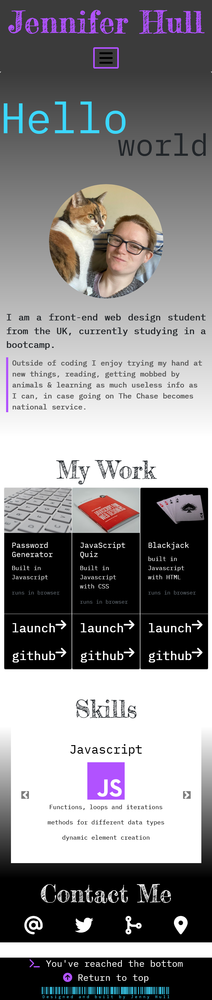

# Bootstrap Portfolio

## Description

This application is a webpage built using Bootstrap, CSS and HTML that shows a portfolio of my work. The page includes a navigation bar with links to sections, a short bio, cards of my projects featuring links to each project and each github repo. There is also a carousel displaying my skills and a series of contact icons that when clicked will each open a modal with the corresponding contact info.

-------
## Installation
The portfolio can be run in-browser including in mobile. 

-------
## Development 

For this project I used Bootstrap v4.6 and took the base html from https://getbootstrap.com/docs/4.6/getting-started/introduction/ . Elements were then styled using HTML to try and target the appropriate elements for styling. I chose fonts from Google Fonts (https://fonts.google.com/) and also used free icons from Font Awesome (https://fontawesome.com/). Photos for project cards were taken from Unsplash (https://unsplash.com/).

I also made a wireframe for this on Canva which I felt helped tremendously for tying together the different sections of the page.

-------
## What I learned

When I first started making this page I was anxious about how many classes each Bootstrap component had and about targeting the correct ones with styling. There was a lot of trial and error plus some googling to check why things weren't doing what I wanted.

I learned more about the structure of bootstrap and what the classes refer to. 

As a bonus I also learned how to create a blinking cursor using only CSS, which is featured in my jumbotron.

-------
## License

This application has an MIT license.

-------
## Links

### URL of GitHub repo:
https://github.com/jh871/Bootstrap-Portfolio

### URL of deployed page:
https://jh871.github.io/Bootstrap-Portfolio/

### URL of previous portfolio page (built with only CSS):
https://jh871.github.io/my-portfolio/

-------
## Screenshot of deployed application:
### Fullscreen:

### Minimised to show responsive design:
